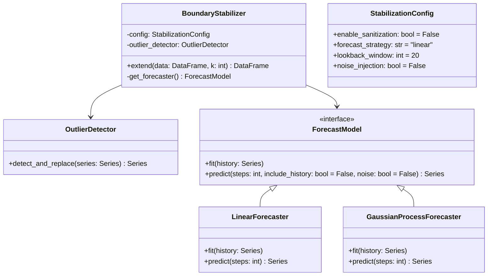

# Design: Boundary Stabilization & Extension (Trend Module 1)

## 1. Introduction

This document outlines the technical design for **Functional Module 1: Boundary Stabilization & Extension**, part of the **Adaptive Trend & Risk Analysis Subsystem**.

The primary goal is to mitigate "edge effects" in signal processing filters (like the $\ell_1$ trend filter) by synthetically extending the time series into the future. This ensures that the filter has "future" data to work with at the current time $t_{now}$, stabilizing the trend extraction at the most critical point (the latest available price).

## 2. Requirements Traceability

From `docs/design/feature-requirements-trend-and-risk-module.md`:

| Req ID | Requirement | Implementation Strategy |
| :--- | :--- | :--- |
| **1.1** | Input: Raw OHLC up to $t_{now}$ | Accept `pandas.DataFrame` with OHLC columns. Focus on End-of-Day (EOD) data updates. |
| **1.2** | Sanitization: Remove microstructure noise/outliers | Implement `OutlierDetector` (Rolling MAD). **Default to OFF** (Optional). |
| **1.3** | Forecast Augmentation: Train short-horizon model | Implement `ForecastModel` strategy interface. |
| **1.4** | Extension: Generate $k$ steps synthetic continuation | Append forecast data to original series. |
| **1.5** | Output: Augmented Series ($N + k$) | Return extended `pandas.DataFrame`. |
| **1.6** | Configuration | Allow selection of forecasting strategy (Linear vs. Advanced) and toggling of sanitization. |

## 3. Architecture

The module will be implemented as a standalone service class `BoundaryStabilizer` which orchestrates the sanitization and extension process. It uses a Strategy pattern for the forecasting logic.

### 3.1. Class Structure



## 4. Component Design

### 4.1. Outlier Detection (Sanitization) - Optional

Microstructure noise and bad ticks can distort trend filters, but for EOD data, this is often handled upstream.

*   **Status**: **Optional** (Default: `False`).
*   **Algorithm**: Rolling Median Absolute Deviation (MAD).
    *   If enabled, replaces outliers ($> n \times MAD$) with rolling median.

### 4.2. Forecasting Strategies

The forecasting model creates the "right-hand side" buffer for the trend filter.

*   **Interface**:
    *   `train(history: np.array)`
    *   `forecast(steps: int) -> np.array`

#### Strategy A: Linear/Polynomial Extrapolation (Baseline)
*   **Description**: Fits a simple linear regression or low-degree polynomial to the recent local window.
*   **Use Case**: Default. Fast, robust, captures immediate local momentum.
*   **Implementation**: `numpy.polyfit` (degree 1 for linear).
*   **Noise Behavior**: When `noise_injection=True`, uses a **Random Walk with Drift** model:
    *   The linear slope provides the drift (expected direction).
    *   Historical volatility (std of first differences) provides the step size.
    *   Each step: `price[t] = price[t-1] + drift + N(0, volatility)`.
*   **Pros**: No extra dependencies, extremely fast, minimal overfitting risk on short windows.
*   **Cons**: Cannot capture complex non-linear dynamics or changing volatility.

#### Strategy B: Gaussian Process Regression (Advanced)
*   **Description**: A non-parametric Bayesian approach.
*   **Why this model?**:
    *   **Non-stationarity**: Adapts to local changes in trend and structure without assuming global parameters.
    *   **Heteroskedasticity**: Can model noise levels explicitly (WhiteKernel) and adapt to changing "wiggliness" (RBF/Matern kernels).
    *   **Smoothness**: Produces smooth continuations desirable for boundary conditions in signal processing.
*   **Implementation**: `scikit-learn.gaussian_process.GaussianProcessRegressor`.
    *   **Kernel**: `ConstantKernel * RBF + WhiteKernel`.
        *   `RBF`: Models the smooth trend.
        *   `WhiteKernel`: Models the noise (heteroskedasticity component).
*   **Noise Behavior**: When `noise_injection=True`, uses `sample_y()` to draw a sample path from the GP posterior distribution, rather than `predict()` which returns the mean.
*   **Pros**: Captures non-linear local dynamics, provides probabilistic output (uncertainty) which can be useful for weighting.
*   **Cons**: Requires `scikit-learn`, computationally more expensive (though negligible for short EOD series).

### 4.3. Extension Logic

1.  **Input**: OHLC DataFrame (Standard EOD format).
2.  **Target**: Extend the **Close** price.
    *   *Note*: For simple trend filtering, `Close` is sufficient. If downstream consumers need High/Low, we will project them maintaining the recent average spread relative to the forecasted Close.
3.  **Process**:
    *   Select lookback window $L$ (defined in config, e.g., 30-60 days).
    *   Extract training vector $Y_{train}$.
    *   If `enable_sanitization`: Clean $Y_{train}$.
    *   Fit selected `ForecastModel`.
    *   Predict $k$ steps ahead.
    *   **Continuity Adjustment**: Apply offset to ensure forecast starts exactly at the last real price (see 4.4).
    *   Append to original DataFrame.

### 4.4. Continuity Adjustment

A critical implementation detail ensures visual and mathematical continuity between the historical data and the forecast:

*   **Problem**: The fitted model's prediction at $t_{now}$ may not exactly equal the last real price due to regression smoothing.
*   **Solution**: Calculate `offset = last_real_price - model_anchor` where `model_anchor` is the model's prediction at the last real time point. Apply this offset to all forecasted values.
*   **Result**: The extension always starts exactly at the last real price, preventing visual "jumps" in charts and ensuring downstream filters see a continuous series.

### 4.5. Noise Injection (Stochastic Extension) - Optional

By default, forecasters produce smooth (deterministic) extensions. For some downstream analyses (e.g., variance-based metrics, wavelet decomposition), a smooth future may introduce artifacts.

*   **Config**: `noise_injection: bool = False`
*   **Purpose**: Inject stochastic variance into the forecast to better simulate realistic future price behavior.
*   **Linear Strategy**: Uses **Random Walk with Drift**:
    *   Drift = linear regression slope (captures trend direction)
    *   Step noise ~ $N(0, \sigma)$ where $\sigma$ = std of historical first differences
    *   Produces a jagged path that mimics daily volatility
*   **GP Strategy**: Uses posterior sampling via `sample_y()` instead of mean prediction, producing paths consistent with the learned covariance structure.

## 5. Data Flow

1.  **Input**: `df_history` (OHLC).
2.  **Config Check**:
    *   If `sanitization` ON -> `df_work = sanitize(df_history)` ELSE `df_work = df_history`.
3.  **Strategy Selection**:
    *   Instantiate `LinearForecaster` OR `GaussianProcessForecaster` based on config.
4.  **Execution**:
    *   `model.fit(df_work['close'].tail(lookback))`
    *   `extension = model.predict(k)`
5.  **Output**:
    *   Return new DataFrame with size $N + k$. Future dates are synthesized.

## 6. Serialization & Visualization

To facilitate validation and debugging of the boundary stabilization feature, the system will generate specific artifacts that expose the extension logic.

### 6.1. Serialization
The calculated boundary extension will be persisted for each processed ticker to allow offline inspection.

*   **Location**: `output/stocks/{ticker}/boundary_extension.json`
*   **Content**: Contains the configuration used (method, lookback) and the time-series of the extension (future dates and prices).
*   **Schema**:
    ```json
    {
      "instrument_id": "cid:etf:us:xyz",
      "primary_ticker": "XYZ",
      "strategy": "gaussian_process",
      "parameters": { "lookback": 30, "steps": 10 },
      "last_real_date": "2024-01-01",
      "extension": [
        { "date": "2024-01-02", "price": 101.5 },
        { "date": "2024-01-03", "price": 102.0 }
      ]
    }
    ```

### 6.2. Visualization
The existing candlestick charting module will be enhanced to overlay the boundary extension on the standard stock charts.

*   **Target**: `candle_ohlcv` charts generated during analysis (saved in `output/stocks/{ticker}/...`).
*   **Visual Style**:
    *   **Line**: A dotted black line connecting the last real `Close` price to the extended points.
    *   **Axis**: The x-axis will be automatically rescaled to include the future $k$ dates.
    *   **Indicator**: A vertical dashed line at $t_{now}$ (last real date) to visually separate historical data from the projection.

### 6.3. Wavelet Integration

The primary use case for boundary stabilization is to improve wavelet transform quality at $t_{now}$.

*   **Pipeline Order**: Boundary extension runs *before* wavelet computation.
*   **Process**:
    1.  Load `boundary_extension.json` if it exists.
    2.  Append extension prices/dates to the input series.
    3.  Compute MODWT on the extended series (length $N + k$).
    4.  Reconstruct log-price series from wavelet coefficients.
    5.  **Truncate** all results back to length $N$ (original data only).
*   **Effect**: Edge artifacts from the wavelet transform are pushed into the synthetic future segment, which is then discarded. The coefficients and reconstructed trends at $t_{now}$ are now mathematically stabilized.
*   **Metadata**: `analysis/wavelet_reconstructed_prices.json` includes `boundary_stabilized: true` when extension was used.
*   **Chart Output**: The `candle_ohlcv_2y_wavelet_trends.png` chart shows stabilized trends ending at the last real date (no future data displayed).

## 7. Implementation Plan

### 7.1. Location
*   Source: `src/portfolio_advisor/trend/boundary.py`
*   Unit Tests: `tests/test_trend_boundary.py`
*   Integration Tests: `tests/test_boundary_integration.py`

### 7.2. Dependencies
*   **Core**: `numpy`, `pandas`.
*   **Advanced Strategy**: `scikit-learn` (Add to `pyproject.toml`).

### 7.3. Interface Specification

```python
from dataclasses import dataclass
from enum import Enum
import pandas as pd
import numpy as np
from typing import Protocol, Optional

class ForecastStrategy(Enum):
    LINEAR = "linear"
    GAUSSIAN_PROCESS = "gaussian_process"

@dataclass
class StabilizationConfig:
    enable_sanitization: bool = False
    strategy: ForecastStrategy = ForecastStrategy.LINEAR
    lookback_period: int = 30
    mad_threshold: float = 3.0
    noise_injection: bool = False

class ForecastModel(Protocol):
    def fit(self, data: np.ndarray) -> None: ...
    def predict(self, steps: int, include_history: bool = False, noise: bool = False) -> np.ndarray: ...

class BoundaryStabilizer:
    def __init__(self, config: StabilizationConfig):
        self.config = config
        # ...

    def extend_series(self, df: pd.DataFrame, k: int) -> pd.DataFrame:
        # Implementation of flow
        pass
```

### 7.4. Tasks
1.  ✅ **Core Logic**: Implement `BoundaryStabilizer` and strategies (Linear, GP).
2.  ✅ **Serialization**: Implement the JSON writer to save `boundary_extension.json` alongside stock data.
3.  ✅ **Visualization**: Update `src/portfolio_advisor/stocks/plotting.py` to draw the extension line.
4.  ✅ **Integration**: Hook the stabilizer into the main analysis pipeline.
5.  ✅ **Wavelet Integration**: Enable wavelet analysis to use extension for boundary stabilization.

## 8. Implementation Status

**Status**: ✅ Complete

### 8.1. Completed Tasks
1.  ✅ Added `scikit-learn` to dependencies (`pyproject.toml`).
2.  ✅ Implemented `BoundaryStabilizer` core logic with Linear and GP strategies.
3.  ✅ Implemented JSON serialization to `output/stocks/{ticker}/analysis/boundary_extension.json`.
4.  ✅ Updated `render_candlestick_ohlcv_1y` to overlay extension with dotted line and $t_{now}$ marker.
5.  ✅ Integrated into stock analysis graph (`graphs/stocks.py`) with proper node ordering.
6.  ✅ Implemented continuity adjustment for seamless extension start.
7.  ✅ Implemented `noise_injection` option for stochastic extensions.
8.  ✅ Integrated with wavelet analysis (extend → compute → truncate pattern).
9.  ✅ Fixed wavelet trend overlay rendering for extended timelines.

### 8.2. CLI Options
*   `--enable-boundary-extension`: Enable the stabilization feature.
*   `--boundary-strategy {linear,gaussian_process}`: Select forecasting method.
*   `--boundary-steps N`: Number of future steps to generate.
*   `--boundary-lookback N`: Historical lookback window for model fitting.
*   `--boundary-noise-injection`: Enable stochastic noise in forecasts.

### 8.3. Configuration
Environment variables (or `.env`):
*   `BOUNDARY_EXTENSION_ENABLED=true`
*   `BOUNDARY_STRATEGY=linear`
*   `BOUNDARY_STEPS=100`
*   `BOUNDARY_LOOKBACK=300`
*   `BOUNDARY_NOISE_INJECTION=false`
