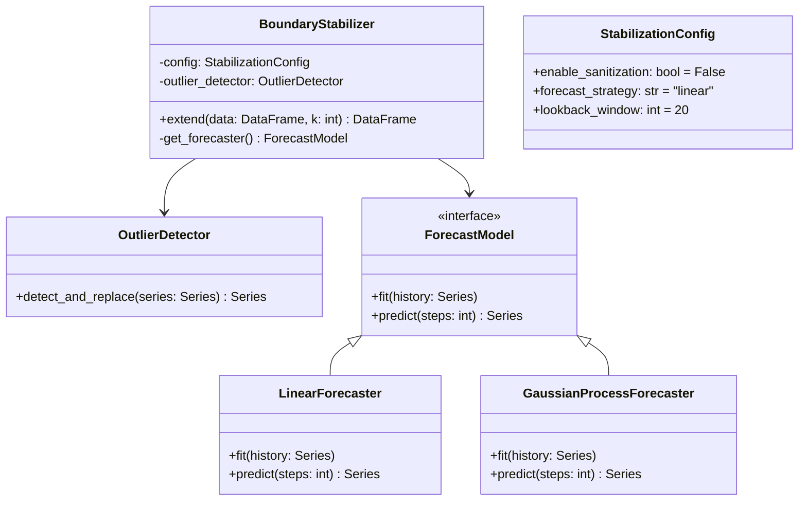

# Design: Boundary Stabilization & Extension (Trend Module 1)

## 1. Introduction

This document outlines the technical design for **Functional Module 1: Boundary Stabilization & Extension**, part of the **Adaptive Trend & Risk Analysis Subsystem**.

The primary goal is to mitigate "edge effects" in signal processing filters (like the $\ell_1$ trend filter) by synthetically extending the time series into the future. This ensures that the filter has "future" data to work with at the current time $t_{now}$, stabilizing the trend extraction at the most critical point (the latest available price).

## 2. Requirements Traceability

From `docs/design/feature-requirements-trend-and-risk-module.md`:

| Req ID | Requirement | Implementation Strategy |
| :--- | :--- | :--- |
| **1.1** | Input: Raw OHLC up to $t_{now}$ | Accept `pandas.DataFrame` with OHLC columns. Focus on End-of-Day (EOD) data updates. |
| **1.2** | Sanitization: Remove microstructure noise/outliers | Implement `OutlierDetector` (Rolling MAD). **Default to OFF** (Optional). |
| **1.3** | Forecast Augmentation: Train short-horizon model | Implement `ForecastModel` strategy interface. |
| **1.4** | Extension: Generate $k$ steps synthetic continuation | Append forecast data to original series. |
| **1.5** | Output: Augmented Series ($N + k$) | Return extended `pandas.DataFrame`. |
| **1.6** | Configuration | Allow selection of forecasting strategy (Linear vs. Advanced) and toggling of sanitization. |

## 3. Architecture

The module will be implemented as a standalone service class `BoundaryStabilizer` which orchestrates the sanitization and extension process. It uses a Strategy pattern for the forecasting logic.

### 3.1. Class Structure



## 4. Component Design

### 4.1. Outlier Detection (Sanitization) - Optional

Microstructure noise and bad ticks can distort trend filters, but for EOD data, this is often handled upstream.

*   **Status**: **Optional** (Default: `False`).
*   **Algorithm**: Rolling Median Absolute Deviation (MAD).
    *   If enabled, replaces outliers ($> n \times MAD$) with rolling median.

### 4.2. Forecasting Strategies

The forecasting model creates the "right-hand side" buffer for the trend filter.

*   **Interface**:
    *   `train(history: np.array)`
    *   `forecast(steps: int) -> np.array`

#### Strategy A: Linear/Polynomial Extrapolation (Baseline)
*   **Description**: Fits a simple linear regression or low-degree polynomial to the recent local window.
*   **Use Case**: Default. Fast, robust, captures immediate local momentum.
*   **Implementation**: `numpy.polyfit` (degree 1 for linear).
*   **Pros**: No extra dependencies, extremely fast, minimal overfitting risk on short windows.
*   **Cons**: Cannot capture complex non-linear dynamics or changing volatility.

#### Strategy B: Gaussian Process Regression (Advanced)
*   **Description**: A non-parametric Bayesian approach.
*   **Why this model?**:
    *   **Non-stationarity**: Adapts to local changes in trend and structure without assuming global parameters.
    *   **Heteroskedasticity**: Can model noise levels explicitly (WhiteKernel) and adapt to changing "wiggliness" (RBF/Matern kernels).
    *   **Smoothness**: Produces smooth continuations desirable for boundary conditions in signal processing.
*   **Implementation**: `scikit-learn.gaussian_process.GaussianProcessRegressor`.
    *   **Kernel**: `ConstantKernel * RBF + WhiteKernel`.
        *   `RBF`: Models the smooth trend.
        *   `WhiteKernel`: Models the noise (heteroskedasticity component).
*   **Pros**: Captures non-linear local dynamics, provides probabilistic output (uncertainty) which can be useful for weighting.
*   **Cons**: Requires `scikit-learn`, computationally more expensive (though negligible for short EOD series).

### 4.3. Extension Logic

1.  **Input**: OHLC DataFrame (Standard EOD format).
2.  **Target**: Extend the **Close** price.
    *   *Note*: For simple trend filtering, `Close` is sufficient. If downstream consumers need High/Low, we will project them maintaining the recent average spread relative to the forecasted Close.
3.  **Process**:
    *   Select lookback window $L$ (defined in config, e.g., 30-60 days).
    *   Extract training vector $Y_{train}$.
    *   If `enable_sanitization`: Clean $Y_{train}$.
    *   Fit selected `ForecastModel`.
    *   Predict $k$ steps ahead.
    *   Append to original DataFrame.

## 5. Data Flow

1.  **Input**: `df_history` (OHLC).
2.  **Config Check**:
    *   If `sanitization` ON -> `df_work = sanitize(df_history)` ELSE `df_work = df_history`.
3.  **Strategy Selection**:
    *   Instantiate `LinearForecaster` OR `GaussianProcessForecaster` based on config.
4.  **Execution**:
    *   `model.fit(df_work['close'].tail(lookback))`
    *   `extension = model.predict(k)`
5.  **Output**:
    *   Return new DataFrame with size $N + k$. Future dates are synthesized.

## 6. Implementation Plan

### 6.1. Location
*   Source: `src/portfolio_advisor/trend/boundary.py`
*   Tests: `tests/test_trend_boundary.py`

### 6.2. Dependencies
*   **Core**: `numpy`, `pandas`.
*   **Advanced Strategy**: `scikit-learn` (Add to `pyproject.toml` as optional or main dependency if we commit to using it).
    *   *Decision*: Add `scikit-learn` to `pyproject.toml`.

### 6.3. Interface Specification

```python
from dataclasses import dataclass
from enum import Enum
import pandas as pd
import numpy as np
from typing import Protocol, Optional

class ForecastStrategy(Enum):
    LINEAR = "linear"
    GAUSSIAN_PROCESS = "gaussian_process"

@dataclass
class StabilizationConfig:
    enable_sanitization: bool = False
    strategy: ForecastStrategy = ForecastStrategy.LINEAR
    lookback_period: int = 30
    mad_threshold: float = 3.0

class ForecastModel(Protocol):
    def fit(self, data: np.ndarray) -> None: ...
    def predict(self, steps: int) -> np.ndarray: ...

class BoundaryStabilizer:
    def __init__(self, config: StabilizationConfig):
        self.config = config
        # ...

    def extend_series(self, df: pd.DataFrame, k: int) -> pd.DataFrame:
        # Implementation of flow
        pass
```

## 7. Next Steps
1.  Add `scikit-learn` to dependencies.
2.  Implement `BoundaryStabilizer` with `LinearForecaster`.
3.  Implement `GaussianProcessForecaster`.
4.  Write unit tests comparing baseline vs advanced on synthetic heteroskedastic data.
