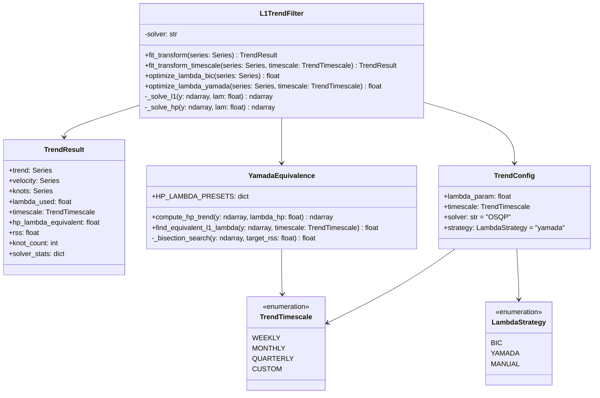

# Design: Sparse Trend Extraction (Trend Module 2)

> **Status**: ✅ **Implemented** (November 2024)
>
> See: `docs/implementation/l1-trend-filtering-implementation.md` for implementation details.

## 1. Introduction

This document outlines the technical design for **Functional Module 2: Sparse Trend Extraction**, part of the **Adaptive Trend & Risk Analysis Subsystem**.

The module implements $\ell_1$ Trend Filtering to isolate the underlying trend of a financial time series as a piecewise linear function. This method explicitly identifies "knots" (points where trend velocity changes) rather than smoothing them out, making it superior for detecting structural market breaks compared to traditional moving averages or HP filters.

## 2. Requirements Traceability

From `docs/design/feature-requirements-trend-and-risk-module.md`:

| Req ID | Requirement | Implementation Strategy |
| :--- | :--- | :--- |
| **2.1** | Input: Augmented Time Series | Accept `pandas.DataFrame` (output of Module 1). |
| **2.2** | $\ell_1$ Optimization: Minimize $\ell_1$ norm of 2nd difference | Use `cvxpy` with `OSQP` solver to solve the convex optimization problem. |
| **2.3** | Velocity Signal: Compute discrete derivative | Calculate first differences of the extracted trend. |
| **2.4** | Truncation: Remove augmented steps | Slices the result to original series length $N$. |
| **2.5** | Knot Map: Identify structural breaks | Boolean vector where second difference is non-zero. |
| **2.6** | Output: Trend, Velocity, Knots | Return structured `TrendResult` object. |

## 3. Architecture

The module will be implemented as a standalone service class `L1TrendFilter` which encapsulates the optimization logic.

### 3.1. Class Structure



## 4. Component Design

### 4.1. L1 Trend Filter Algorithm

The core mathematical problem is to find the trend $x$ that minimizes:

$$ \frac{1}{2} \|y - x\|_2^2 + \lambda \|Dx\|_1 $$

Where $D$ is the second difference matrix.

*   **Library**: `cvxpy` (Convex Optimization for Python).
*   **Solver**: `OSQP` (Operator Splitting Quadratic Program).
    *   **Reasoning**: Fast, robust, and default for `cvxpy`. Good for sparse problems.
*   **Fallback**: If `OSQP` fails, fallback to `ECOS` or `SCS`.

### 4.2. Lambda Selection ($\lambda$)

The regularization parameter $\lambda$ controls the trade-off between fitting the data (low $\lambda$) and enforcing linearity (high $\lambda$). We support two strategies: data-driven BIC optimization and the Yamada Equivalence method for timescale targeting.

#### 4.2.1. Strategy A: Bayesian Information Criterion (BIC)

A purely data-driven approach that balances fit quality against model complexity.

*   **Formula**: $BIC(\lambda) = n \ln(MSE) + \ln(n) \cdot df(\lambda)$
    *   $df(\lambda) = $ number of knots + 2.
*   **Optimization**:
    *   Search a grid of $\lambda$ values (log-spaced).
    *   Select $\lambda$ that minimizes BIC.
    *   **Range**: Typically $0.1$ to $1000$ for daily price data.

#### 4.2.2. Strategy B: Yamada Equivalence Method (Recommended for Timescale Targeting)

This strategy derives $\lambda_{\ell_1}$ by matching the residual variance of a known Hodrick-Prescott (HP) filter, creating a bridge between frequency-based timescale selection and sparse trend estimation.

##### Theoretical Foundation

The HP filter has well-established $\lambda_{HP}$ values that correspond to specific cycle lengths (timescales). Yamada (2018) demonstrated that an $\ell_1$ filter can be considered "equivalent" to an HP filter if they partition signal energy identically:

$$ \|y - \hat{x}_{\ell_1}(\lambda_{\ell_1})\|_2^2 = \|y - \hat{x}_{HP}(\lambda_{HP})\|_2^2 $$

This allows analysts to specify a desired timescale (weekly, monthly, quarterly) via established HP conventions, then automatically derive the corresponding $\ell_1$ parameter.

##### HP Lambda Presets for Daily Data

The HP filter's smoothing parameter relates to the cutoff period $T$ (in observations). For daily trading data (252 days/year), empirically calibrated presets are:

| Timescale | Target Period | Trading Days | $\lambda_{HP}$ (Daily) | Interpretation |
| :--- | :--- | :--- | ---: | :--- |
| **Weekly** | 1 week | 5 | 270 | Captures intra-month volatility; highly reactive to short-term moves. |
| **Monthly** | 1 month | 21 | 14,400 | Filters microstructure noise; identifies swing trading regimes. |
| **Quarterly** | 3 months | 63 | 1,600,000 | Macro trend; appropriate for position trading and earnings cycles. |

*Note*: The monthly value 14,400 corresponds to the Ravn-Uhlig adjustment of the standard quarterly HP $\lambda = 1600$ for monthly data. The weekly and quarterly values are extrapolated using the scaling relationship $\lambda \propto T^4$.

##### Equivalence Search Algorithm

Given a target timescale, the algorithm finds $\lambda_{\ell_1}$ via bisection search:

```
Input: Time series y, Target timescale T ∈ {WEEKLY, MONTHLY, QUARTERLY}
Output: λ_l1 such that RSS(l1) ≈ RSS(HP)

1. Look up λ_HP from preset table based on T
2. Compute HP trend: x̂_HP = HP_filter(y, λ_HP)
3. Calculate target RSS: S_target = ||y - x̂_HP||₂²
4. Initialize bounds: λ_min = 0.01, λ_max = 10000
5. While (λ_max - λ_min) > tolerance:
   a. λ_test = (λ_min + λ_max) / 2
   b. Solve x̂_l1 = L1_filter(y, λ_test)
   c. Calculate S_l1 = ||y - x̂_l1||₂²
   d. If S_l1 > S_target:  // L1 is too smooth
        λ_max = λ_test
      Else:                 // L1 is too rough
        λ_min = λ_test
6. Return λ_test
```

**Convergence Properties**:
*   RSS is a continuous, strictly monotonic function of $\lambda$.
*   Bisection converges in $O(\log_2(\lambda_{max}/tolerance))$ iterations.
*   Each iteration requires one L1 solve ($O(n)$ with specialized solver).
*   Total complexity: $O(n \cdot \log(\lambda_{max}))$ — practical for real-time use.

##### Comparison: HP vs Equivalent $\ell_1$ Behavior

While the Yamada method equates residual variance, the *structure* of the extracted trends differs fundamentally:

| Characteristic | HP Filter ($\ell_2$) | Equivalent $\ell_1$ Filter |
| :--- | :--- | :--- |
| **Trend Shape** | Smooth, curved transitions | Piecewise linear segments |
| **Regime Changes** | Gradual turn over multiple periods | Sharp vertex at specific timestamp |
| **Turning Point Detection** | Lags the true peak/trough | Pinpoints the exact break date |
| **Noise Handling** | Diffuses outliers across neighbors | Absorbs outliers into residuals |

**Use Case**: The Yamada equivalent $\ell_1$ is superior when the analyst needs to identify *when* a trend reversal occurred (e.g., market regime change, earnings impact date) rather than merely smooth the series.

#### 4.2.3. Timescale Enum and Configuration

```python
from enum import Enum

class TrendTimescale(Enum):
    """Predefined timescales for trend extraction."""
    WEEKLY = "weekly"      # ~5 trading day cycles
    MONTHLY = "monthly"    # ~21 trading day cycles
    QUARTERLY = "quarterly"  # ~63 trading day cycles
    CUSTOM = "custom"      # User-specified lambda

# HP lambda presets for daily trading data
HP_LAMBDA_PRESETS: dict[TrendTimescale, float] = {
    TrendTimescale.WEEKLY: 270,
    TrendTimescale.MONTHLY: 14_400,
    TrendTimescale.QUARTERLY: 1_600_000,
}
```

#### 4.2.4. Lambda Selection Decision Matrix

| Use Case | Recommended Strategy | Rationale |
| :--- | :--- | :--- |
| Exploratory analysis, unknown timescale | **BIC** | Data-driven; no prior assumptions needed. |
| Weekly swing trading signals | **Yamada (WEEKLY)** | Matches established short-term cycle benchmarks. |
| Monthly regime detection | **Yamada (MONTHLY)** | Standard benchmark for position trading. |
| Quarterly/macro trend analysis | **Yamada (QUARTERLY)** | Aligned with earnings cycles and economic benchmarks. |
| Academic comparability with HP literature | **Yamada** | Ensures identical noise budget as HP studies. |

### 4.3. Artifacts Computation

Once the trend $x$ is solved:

1.  **Trend**: $x$ (The piecewise linear fit).
2.  **Velocity**: $\Delta x_t = x_t - x_{t-1}$.
    *   Represents the current "slope" or rate of change (dollars/day).
3.  **Knots**: Points where $\Delta^2 x_t \neq 0$.
    *   Practically: $|x_{t-1} - 2x_t + x_{t+1}| > \epsilon$.
    *   $\epsilon$: Small tolerance (e.g., $1e-6$).

### 4.4. Integration with Boundary Extension & Pipeline Order

This module explicitly consumes the output of Module 1 (Boundary Extension) and runs in parallel with or immediately adjacent to the Wavelet Decomposition module.

1.  **Pipeline Order**:
    *   Step 1: Boundary Extension (extends series to $N+k$).
    *   Step 2a: Wavelet Decomposition (uses extended series).
    *   **Step 2b: L1 Trend Extraction** (uses extended series).
    *   Step 3: Risk/Regime Analysis (consumes outputs from 2a and 2b).

2.  **Input**: `extended_df` (Length $N + k$) from Module 1.
    *   If Module 1 is disabled, it falls back to the raw OHLC series (Length $N$).

3.  **Process**: Run L1 Filter on the full input series.
    *   The extension provides future context that stabilizes the optimization at the "current" time $t_{now}$, mitigating end-point bias.

4.  **Truncation**:
    *   After solving for the trend on the augmented series, the result is sliced to length $N$.
    *   The synthetic future segment is discarded; only the stabilized value at $t_{now}$ is retained.

## 5. Data Flow

1.  **Input**: `state["boundary_extension_output"]` or raw OHLC.
2.  **Configuration**: Load `TrendConfig` (lambda, auto-tune).
3.  **Execution**:
    *   `filter = L1TrendFilter(config)`
    *   `result = filter.fit_transform(input_series)`
4.  **Post-Processing**:
    *   Truncate if extension was used.
    *   Compute auxiliary metrics (velocity, knots).
5.  **Output**:
    *   Save `analysis/trend_l1.json`.
    *   Update `state` for downstream risk modules.

## 6. Serialization & Visualization

### 6.1. Serialization

*   **Location**: `output/stocks/{ticker}/analysis/trend_l1.json`
*   **Schema**:
    ```json
    {
      "lambda_l1": 42.5,
      "timescale": "monthly",
      "strategy": "yamada",
      "hp_lambda_equivalent": 14400,
      "rss": 1523.45,
      "mse": 3.05,
      "knot_count": 24,
      "current_velocity": 0.75,
      "trend": [ ... ],
      "knots": [ "2024-01-15", "2024-03-22", ... ],
      "solver_stats": {
        "solver": "OSQP",
        "iterations": 127,
        "solve_time_ms": 12.3
      }
    }
    ```

### 6.2. Visualization

The system will generate a dedicated visualization graph for the extracted trend structure, similar to the wavelet trend graphs.

*   **Target File**: `candle_ohlcv_2y_l1_trends.png`
*   **Layout**: 3 vertically stacked subplots sharing the X-axis (time).

#### Panel 1: Price & Structural Trend
*   **Candlesticks**: Standard OHLC candles (gray/faded).
*   **Trend Line**: The extracted piecewise linear trend $x$ (thick Blue line).
*   **Knots**: Markers (e.g., Orange Diamonds) plotted on the trend line at timestamps where structural breaks occurred.
*   **Title**: "L1 Trend Structure (lambda={lambda})"

#### Panel 2: Trend Velocity (Regime State)
*   **Line**: The velocity signal $\Delta x_t$.
*   **Type**: Step plot (since velocity is piecewise constant).
*   **Zero Line**: Dashed horizontal line at 0.
*   **Color**: Green for positive velocity (uptrend), Red for negative (downtrend).
*   **Title**: "Trend Velocity ($/day)"

#### Panel 3: Residuals
*   **Bar**: Residuals ($Price - Trend$).
*   **Color**: Gray bars.
*   **Bands**: Optional standard deviation bands to visualize volatility regimes.
*   **Title**: "Residuals (Noise)"

## 7. Implementation Plan

### 7.1. Location
*   Source: `src/portfolio_advisor/trend/l1_filter.py`
*   Tests: `tests/test_trend_l1.py`

### 7.2. Dependencies
*   `cvxpy`: **New dependency**.
*   `numpy`, `pandas`.

### 7.3. Interface Specification

```python
from dataclasses import dataclass
from enum import Enum
import pandas as pd
import numpy as np
from typing import Optional


class TrendTimescale(Enum):
    """Predefined timescales for trend extraction."""
    WEEKLY = "weekly"
    MONTHLY = "monthly"
    QUARTERLY = "quarterly"
    CUSTOM = "custom"


class LambdaStrategy(Enum):
    """Strategy for selecting the regularization parameter."""
    BIC = "bic"          # Data-driven Bayesian Information Criterion
    YAMADA = "yamada"    # HP-equivalent via Yamada method
    MANUAL = "manual"    # User-specified lambda


# HP lambda presets for daily trading data (252 days/year)
HP_LAMBDA_PRESETS: dict[TrendTimescale, float] = {
    TrendTimescale.WEEKLY: 270,
    TrendTimescale.MONTHLY: 14_400,
    TrendTimescale.QUARTERLY: 1_600_000,
}


@dataclass
class TrendResult:
    """Result container for L1 trend extraction."""
    trend: pd.Series              # Piecewise linear trend
    velocity: pd.Series           # First difference of trend (slope)
    knots: pd.Series              # Boolean mask of structural breaks
    lambda_used: float            # L1 lambda that produced this result
    timescale: TrendTimescale     # Timescale used (or CUSTOM)
    hp_lambda_equivalent: float   # Corresponding HP lambda (for Yamada)
    rss: float                    # Residual sum of squares
    knot_count: int               # Number of detected knots
    solver_stats: dict            # Solver diagnostics


class YamadaEquivalence:
    """
    Implements the Yamada Equivalence method for deriving L1 lambda
    from HP filter benchmarks.

    Reference: Yamada, H. (2018). "A New Method for Specifying the
    Tuning Parameter of ℓ₁ Trend Filtering."
    """

    def __init__(self, tolerance: float = 1e-4, max_iterations: int = 50):
        self.tolerance = tolerance
        self.max_iterations = max_iterations

    def compute_hp_trend(self, y: np.ndarray, lambda_hp: float) -> np.ndarray:
        """
        Compute Hodrick-Prescott filter trend.

        Uses the standard HP formulation:
        min_x (1/2)||y - x||_2^2 + λ||D²x||_2^2

        Args:
            y: Input time series (1D array).
            lambda_hp: HP smoothing parameter.

        Returns:
            HP trend estimate.
        """
        ...

    def find_equivalent_l1_lambda(
        self,
        y: np.ndarray,
        timescale: TrendTimescale,
        l1_solver: callable,
    ) -> tuple[float, float]:
        """
        Find L1 lambda that produces equivalent RSS to HP filter.

        Args:
            y: Input time series.
            timescale: Target timescale (WEEKLY, MONTHLY, QUARTERLY).
            l1_solver: Callable that solves L1 problem given (y, lambda).

        Returns:
            Tuple of (l1_lambda, target_rss).
        """
        lambda_hp = HP_LAMBDA_PRESETS[timescale]
        hp_trend = self.compute_hp_trend(y, lambda_hp)
        target_rss = np.sum((y - hp_trend) ** 2)
        l1_lambda = self._bisection_search(y, target_rss, l1_solver)
        return l1_lambda, target_rss

    def _bisection_search(
        self,
        y: np.ndarray,
        target_rss: float,
        l1_solver: callable,
        lambda_min: float = 0.01,
        lambda_max: float = 10_000,
    ) -> float:
        """
        Bisection search to find L1 lambda matching target RSS.

        The RSS of L1 filter is monotonically increasing with lambda,
        guaranteeing convergence.
        """
        for _ in range(self.max_iterations):
            if (lambda_max - lambda_min) < self.tolerance:
                break
            lambda_test = (lambda_min + lambda_max) / 2
            trend = l1_solver(y, lambda_test)
            rss = np.sum((y - trend) ** 2)
            if rss > target_rss:
                lambda_max = lambda_test  # L1 too smooth, reduce lambda
            else:
                lambda_min = lambda_test  # L1 too rough, increase lambda
        return (lambda_min + lambda_max) / 2


class L1TrendFilter:
    """
    L1 Trend Filter with multiple lambda selection strategies.

    Supports:
    - Manual lambda specification
    - BIC-based automatic tuning
    - Yamada Equivalence for timescale targeting
    """

    def __init__(
        self,
        lambda_param: Optional[float] = None,
        timescale: TrendTimescale = TrendTimescale.MONTHLY,
        strategy: LambdaStrategy = LambdaStrategy.YAMADA,
        solver: str = "OSQP",
    ):
        self.lambda_param = lambda_param
        self.timescale = timescale
        self.strategy = strategy
        self.solver = solver
        self._yamada = YamadaEquivalence()

    def fit_transform(self, series: pd.Series) -> TrendResult:
        """
        Extract L1 trend using configured strategy.

        If strategy is YAMADA, derives lambda from HP equivalence.
        If strategy is BIC, searches for optimal lambda via grid search.
        If strategy is MANUAL, uses the provided lambda_param.
        """
        ...

    def fit_transform_timescale(
        self,
        series: pd.Series,
        timescale: TrendTimescale,
    ) -> TrendResult:
        """
        Convenience method to extract trend at a specific timescale.

        Overrides the configured timescale for this call.
        """
        ...

    def optimize_lambda_yamada(
        self,
        series: pd.Series,
        timescale: TrendTimescale,
    ) -> float:
        """Find L1 lambda equivalent to HP filter at given timescale."""
        y = series.to_numpy()
        l1_lambda, _ = self._yamada.find_equivalent_l1_lambda(
            y, timescale, self._solve_l1
        )
        return l1_lambda

    def optimize_lambda_bic(self, series: pd.Series) -> float:
        """Find optimal lambda via BIC grid search."""
        ...

    def _solve_l1(self, y: np.ndarray, lam: float) -> np.ndarray:
        """Solve the L1 trend filtering optimization problem."""
        ...
```

### 7.4. Tasks

All tasks have been completed:

1.  ✅ **Setup**: Add `cvxpy` to `pyproject.toml`.
2.  ✅ **Core L1 Solver**: Implement `L1TrendFilter._solve_l1()` with `cvxpy` + OSQP.
3.  ✅ **HP Filter**: Implement `compute_hp_trend()` for baseline comparison.
4.  ✅ **Yamada Equivalence**: Implement bisection search in `YamadaEquivalence.find_equivalent_l1_lambda()`.
5.  ✅ **BIC Tuning**: Implement `_optimize_lambda()` via grid search.
6.  ✅ **Timescale API**: Implement `fit_transform_timescale()` convenience method.
7.  ✅ **Integration**: Connect to pipeline via `_compute_l1_trend_node()`, with boundary extension support.
8.  ✅ **Output**: Save JSON artifacts with strategy, timescale, hp_lambda_equivalent, and RSS fields.
9.  ✅ **Visualization**: Three-panel chart with trend overlays, velocity plot, and residuals.
10. ✅ **Testing**: Comprehensive test suite in `tests/test_trend_l1.py` covering:
    *   HP filter correctness
    *   Yamada bisection convergence
    *   RSS equivalence validation (L1 RSS ≈ HP RSS within 10% tolerance)
    *   All timescale presets (weekly, monthly, quarterly)
    *   Strategy selection (yamada, bic, manual)
    *   Backwards compatibility (auto_tune → bic)

