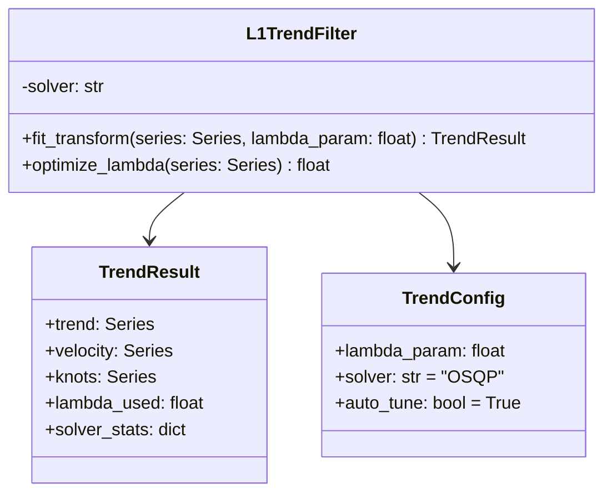

# Design: Sparse Trend Extraction (Trend Module 2)

## 1. Introduction

This document outlines the technical design for **Functional Module 2: Sparse Trend Extraction**, part of the **Adaptive Trend & Risk Analysis Subsystem**.

The module implements $\ell_1$ Trend Filtering to isolate the underlying trend of a financial time series as a piecewise linear function. This method explicitly identifies "knots" (points where trend velocity changes) rather than smoothing them out, making it superior for detecting structural market breaks compared to traditional moving averages or HP filters.

## 2. Requirements Traceability

From `docs/design/feature-requirements-trend-and-risk-module.md`:

| Req ID | Requirement | Implementation Strategy |
| :--- | :--- | :--- |
| **2.1** | Input: Augmented Time Series | Accept `pandas.DataFrame` (output of Module 1). |
| **2.2** | $\ell_1$ Optimization: Minimize $\ell_1$ norm of 2nd difference | Use `cvxpy` with `OSQP` solver to solve the convex optimization problem. |
| **2.3** | Velocity Signal: Compute discrete derivative | Calculate first differences of the extracted trend. |
| **2.4** | Truncation: Remove augmented steps | Slices the result to original series length $N$. |
| **2.5** | Knot Map: Identify structural breaks | Boolean vector where second difference is non-zero. |
| **2.6** | Output: Trend, Velocity, Knots | Return structured `TrendResult` object. |

## 3. Architecture

The module will be implemented as a standalone service class `L1TrendFilter` which encapsulates the optimization logic.

### 3.1. Class Structure



## 4. Component Design

### 4.1. L1 Trend Filter Algorithm

The core mathematical problem is to find the trend $x$ that minimizes:

$$ \frac{1}{2} \|y - x\|_2^2 + \lambda \|Dx\|_1 $$

Where $D$ is the second difference matrix.

*   **Library**: `cvxpy` (Convex Optimization for Python).
*   **Solver**: `OSQP` (Operator Splitting Quadratic Program).
    *   **Reasoning**: Fast, robust, and default for `cvxpy`. Good for sparse problems.
*   **Fallback**: If `OSQP` fails, fallback to `ECOS` or `SCS`.

### 4.2. Lambda Selection ($\lambda$)

The regularization parameter $\lambda$ controls the trade-off between fitting the data (low $\lambda$) and enforcing linearity (high $\lambda$).

*   **Strategy**: Bayesian Information Criterion (BIC).
*   **Formula**: $BIC(\lambda) = n \ln(MSE) + \ln(n) \cdot df(\lambda)$
    *   $df(\lambda) = $ number of knots + 2.
*   **Optimization**:
    *   Search a grid of $\lambda$ values (log-spaced).
    *   Select $\lambda$ that minimizes BIC.
    *   **Range**: Typically $0.1$ to $1000$ for daily price data.

### 4.3. Artifacts Computation

Once the trend $x$ is solved:

1.  **Trend**: $x$ (The piecewise linear fit).
2.  **Velocity**: $\Delta x_t = x_t - x_{t-1}$.
    *   Represents the current "slope" or rate of change (dollars/day).
3.  **Knots**: Points where $\Delta^2 x_t \neq 0$.
    *   Practically: $|x_{t-1} - 2x_t + x_{t+1}| > \epsilon$.
    *   $\epsilon$: Small tolerance (e.g., $1e-6$).

### 4.4. Integration with Boundary Extension & Pipeline Order

This module explicitly consumes the output of Module 1 (Boundary Extension) and runs in parallel with or immediately adjacent to the Wavelet Decomposition module.

1.  **Pipeline Order**:
    *   Step 1: Boundary Extension (extends series to $N+k$).
    *   Step 2a: Wavelet Decomposition (uses extended series).
    *   **Step 2b: L1 Trend Extraction** (uses extended series).
    *   Step 3: Risk/Regime Analysis (consumes outputs from 2a and 2b).

2.  **Input**: `extended_df` (Length $N + k$) from Module 1.
    *   If Module 1 is disabled, it falls back to the raw OHLC series (Length $N$).

3.  **Process**: Run L1 Filter on the full input series.
    *   The extension provides future context that stabilizes the optimization at the "current" time $t_{now}$, mitigating end-point bias.

4.  **Truncation**:
    *   After solving for the trend on the augmented series, the result is sliced to length $N$.
    *   The synthetic future segment is discarded; only the stabilized value at $t_{now}$ is retained.

## 5. Data Flow

1.  **Input**: `state["boundary_extension_output"]` or raw OHLC.
2.  **Configuration**: Load `TrendConfig` (lambda, auto-tune).
3.  **Execution**:
    *   `filter = L1TrendFilter(config)`
    *   `result = filter.fit_transform(input_series)`
4.  **Post-Processing**:
    *   Truncate if extension was used.
    *   Compute auxiliary metrics (velocity, knots).
5.  **Output**:
    *   Save `analysis/trend_l1.json`.
    *   Update `state` for downstream risk modules.

## 6. Serialization & Visualization

### 6.1. Serialization

*   **Location**: `output/stocks/{ticker}/analysis/trend_l1.json`
*   **Schema**:
    ```json
    {
      "lambda": 50.0,
      "mse": 12.45,
      "knots_count": 5,
      "current_velocity": 0.75,
      "trend": [ ... ],
      "knots": [ "2024-01-15", "2024-03-22" ]
    }
    ```

### 6.2. Visualization

The system will generate a dedicated visualization graph for the extracted trend structure, similar to the wavelet trend graphs.

*   **Target File**: `candle_ohlcv_2y_l1_trends.png`
*   **Layout**: 3 vertically stacked subplots sharing the X-axis (time).

#### Panel 1: Price & Structural Trend
*   **Candlesticks**: Standard OHLC candles (gray/faded).
*   **Trend Line**: The extracted piecewise linear trend $x$ (thick Blue line).
*   **Knots**: Markers (e.g., Orange Diamonds) plotted on the trend line at timestamps where structural breaks occurred.
*   **Title**: "L1 Trend Structure (lambda={lambda})"

#### Panel 2: Trend Velocity (Regime State)
*   **Line**: The velocity signal $\Delta x_t$.
*   **Type**: Step plot (since velocity is piecewise constant).
*   **Zero Line**: Dashed horizontal line at 0.
*   **Color**: Green for positive velocity (uptrend), Red for negative (downtrend).
*   **Title**: "Trend Velocity ($/day)"

#### Panel 3: Residuals
*   **Bar**: Residuals ($Price - Trend$).
*   **Color**: Gray bars.
*   **Bands**: Optional standard deviation bands to visualize volatility regimes.
*   **Title**: "Residuals (Noise)"

## 7. Implementation Plan

### 7.1. Location
*   Source: `src/portfolio_advisor/trend/l1_filter.py`
*   Tests: `tests/test_trend_l1.py`

### 7.2. Dependencies
*   `cvxpy`: **New dependency**.
*   `numpy`, `pandas`.

### 7.3. Interface Specification

```python
from dataclasses import dataclass
import pandas as pd
import numpy as np
from typing import Optional

@dataclass
class TrendResult:
    trend: pd.Series
    velocity: pd.Series
    knots: pd.Series  # Boolean mask
    lambda_used: float
    bic: float

class L1TrendFilter:
    def __init__(self, lambda_param: float = 1.0, auto_tune: bool = False):
        ...

    def fit_transform(self, series: pd.Series) -> TrendResult:
        ...

    def _solve_l1(self, y: np.ndarray, lam: float) -> np.ndarray:
        ...
```

### 7.4. Tasks
1.  **Setup**: Add `cvxpy` to `pyproject.toml` (Already done).
2.  **Core**: Implement `L1TrendFilter` with `cvxpy`.
3.  **Tuning**: Implement `optimize_lambda` using BIC grid search.
4.  **Integration**: Connect to pipeline, handling boundary extension input.
5.  **Output**: Save JSON artifacts and update plotting.

